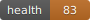

# acme-platform

> ⚠️ **This is a synthetic demonstration repository operated by CodeLedger.**
> Acme Platform is a simulated engineering team for demonstration purposes.
> All commits, PRs, and reviews are generated by the [Synthetic Reality Engine](https://github.com/codeledger-demo/synthetic-reality-engine).

### 👋 First time here?

**→ Read the [8-minute Prospect Guide](./PROSPECT_GUIDE.md) first.** It walks you through what you're looking at, the recommended click path, and what to pay attention to.

**→ Or jump straight to the live dashboard:** [demo.codeledger.dev](https://demo.codeledger.dev) *(publicly accessible — no login required)*.

---

A realistic mid-size B2B SaaS TypeScript monorepo, continuously watched by CodeLedger.

## What This Is

`acme-platform` is the target repo of the **CodeLedger Living Demo Environment** — the Synthetic Reality Engine (SRE). It contains real, compilable TypeScript code structured like a typical production engineering codebase, so that CodeLedger produces meaningful signals against it.

Every commit, PR, and review you see here was generated by the SRE simulator, which executes pre-scripted scenarios authored as YAML. The team — Sara Chen, Marcus Webb, and Priya K — are bot personas with distinct coding styles that produce differentiated CodeLedger signals.

## Architecture

```
acme-platform/
  services/          # Backend services
    auth/            # JWT, sessions, OAuth, password reset
    billing/         # Stripe integration, subscriptions, invoices
    notifications/   # Email, Slack, in-app channels + queue
    reporting/       # Usage, billing, audit reports + exporters
    webhooks/        # Dispatcher with retry + delivery tracking
  packages/          # Shared workspace packages
    shared-utils/    # Logger, errors, config, retry, date
    validation/      # Zod-free validators for user/billing/webhook
    api-client/      # Typed HTTP client + endpoints
    design-tokens/   # Colors, spacing, typography, breakpoints
  apps/              # Frontend applications
    web/             # Next.js 14 public app
    admin/           # React admin panel
    mobile/          # React Native-style mobile app
  infra/             # Terraform + K8s + CI/CD
```

## Build

```bash
pnpm install
pnpm build        # tsc across all workspace projects
pnpm test         # vitest suite (87 tests)
pnpm typecheck
```

## CodeLedger Integration

Two workflows run on every PR:

- **`.github/workflows/codeledger-pr.yml`** — runs `codeledger complete-check` and `codeledger verify`, posts results as PR comment, uploads artifacts

Drift, CIC failures, and Release Authority blocks appear in the public [CodeLedger Demo Dashboard](https://demo.codeledger.dev).

## Related Repos

- **synthetic-reality-engine** — the simulator that drives this repo
- **demo-dashboard** — the prospect-facing dashboard at demo.codeledger.dev

## License

Intelligent Context AI Inc. — Confidential. Internal use only.

<!-- DRAMA:START -->
## Living Development Feed

> This is a synthetic demonstration repository operated by CodeLedger.

**Current Arc:** Feature Showcase (Arc 7)
**Team Health:** 🟡 82/100
**Last Activity:** 1h ago

### Recent Headlines

- **✅ 📊 Truth grade climbs C→B→A as release evidence accumulates** *(1h ago, sara-chen)*
- **📋 🧭 Coach guides Marcus using Sara's golden billing pattern** *(yesterday, marcus-webb)*
- **✅ ⭐ Sara's billing pattern promoted to Golden Pattern status** *(4 days ago, sara-chen)*
- **✅ ⭐ Sara's billing pattern promoted to Golden Pattern status** *(4 days ago, sara-chen)*
- **✅ ✨ Golden Pattern matched: Priya followed Sara's notification template approach** *(4 days ago, priya-k)*

### Developer Scorecards

| Developer | CIC Pass Rate | PRs (30d) | Trend |
|-----------|--------------|-----------|-------|
| Sara Chen | 0% | 5 | — |
| Marcus Webb | 0% | 4 | — |
| Priya K | 0% | 4 | — |



---
[View full dashboard](https://demo.codeledger.dev) | [Request a demo](https://codeledger.dev/demo)
<!-- DRAMA:END -->
